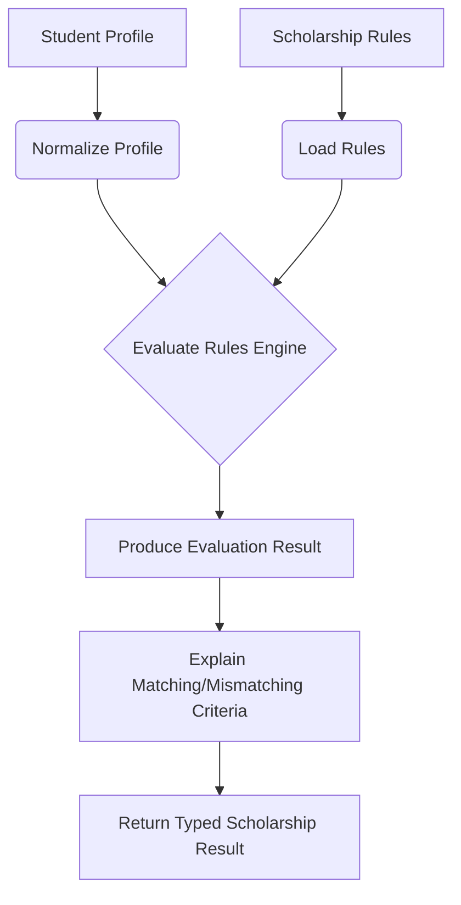

# Scholar Mate — Eligibility Engine

## 1. Core Purpose
The Eligibility Engine is the intellectual core of Scholar Mate. Its sole purpose is to evaluate a specific Student Profile against a set of Scholarship Eligibility Rules and determine a match status with complete explainability.

## 2. Guiding Principles
- **Deterministic**: The engine never guesses. The same profile and the same rules must always yield the exact same result.
- **Explainable**: The engine must return reasons *why* a scholarship matched or failed (e.g., "Income exceeds maximum threshold of ₹2,50,000").
- **Strict Information handling**: Missing information is NEVER treated as a match. It results in a specific `NEEDS_INFORMATION` status.
- **Testable**: The engine is a pure TypeScript service, decoupled from Next.js request/response objects or direct UI dependencies. It takes a typed `Profile` object and a typed `ScholarshipRule` object as inputs.
- **Efficient**: Eligibility evaluation must remain deterministic and efficient.
- **Pre-filtering**: Filter candidates at the database/query level before detailed evaluation where possible. Do not scan all scholarships for every request if a narrower candidate query can be performed.
- **No Duplicate Work**: Avoid repeated eligibility computation within a single request. Avoid recalculating identical results unnecessarily.
- **No Premature Caching**: Caching may be considered only for measured hot or expensive workloads. Do not add Redis or any caching dependency now.

## 3. Evaluation Statuses

The Engine returns one of four possible statuses for any evaluated scholarship:

1. **ELIGIBLE**: The student meets all explicitly defined criteria.
2. **NOT_ELIGIBLE**: The student explicitly fails one or more defined criteria (e.g., state mismatch, income too high).
3. **NEEDS_INFORMATION**: The scholarship requires a specific data point (e.g., Category, Income) that is missing from the student's profile.
4. **REQUIRES_VERIFICATION**: The student appears eligible, but the scholarship contains ambiguous criteria or requires manual offline verification (e.g., "Must be recommended by principal").

## 4. Logical Flow



## 5. Evaluation Mechanism

The engine processes criteria in layers:
1. **Hard Exclusions (Fast Fail)**: Checks gender, state, category, and education level. If any of these strictly fail, immediately return `NOT_ELIGIBLE` with the fail reason.
2. **Threshold Checks**: Evaluates `familyIncome` (min/max) and `academicPerformance`.
3. **Data Completeness**: If a rule mandates a check (e.g., `maxFamilyIncome` is set) but the student profile lacks `familyIncome`, immediately halt and flag `NEEDS_INFORMATION` regarding `familyIncome`.
4. **Pass**: If all defined rules pass or are null (meaning the scholarship does not restrict that attribute), return `ELIGIBLE`.

## 6. Implementation Strategy (Draft)

```typescript
type EvaluationResult = {
  status: 'ELIGIBLE' | 'NOT_ELIGIBLE' | 'NEEDS_INFORMATION' | 'REQUIRES_VERIFICATION';
  reasons: string[]; // e.g., ["Matches Karnataka residency", "Income below 2 LPA"]
  missingFields?: string[]; // e.g., ["familyIncome", "category"]
};

// Pure function signature
function evaluateEligibility(profile: StudentProfile, rules: ScholarshipRules): EvaluationResult {
  // Implementation
}
```

## 7. Testing Requirements
The Eligibility Engine MUST have comprehensive unit tests covering:
- Exact matches
- Complete mismatches
- Edge cases on threshold boundaries (e.g., income exactly at max)
- Missing student data scenarios
- Missing scholarship rule scenarios (open eligibility)
